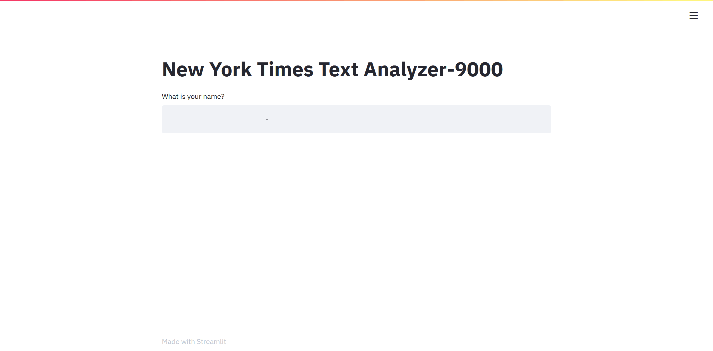

### NYT Text Analyzer 
Used Python and the Natural Language Tool Kit (NLTK) to analyze frequency of word occurrences in specific categories of articles. 
Presented data to user in graph and word-cloud form via Streamlit framework.

